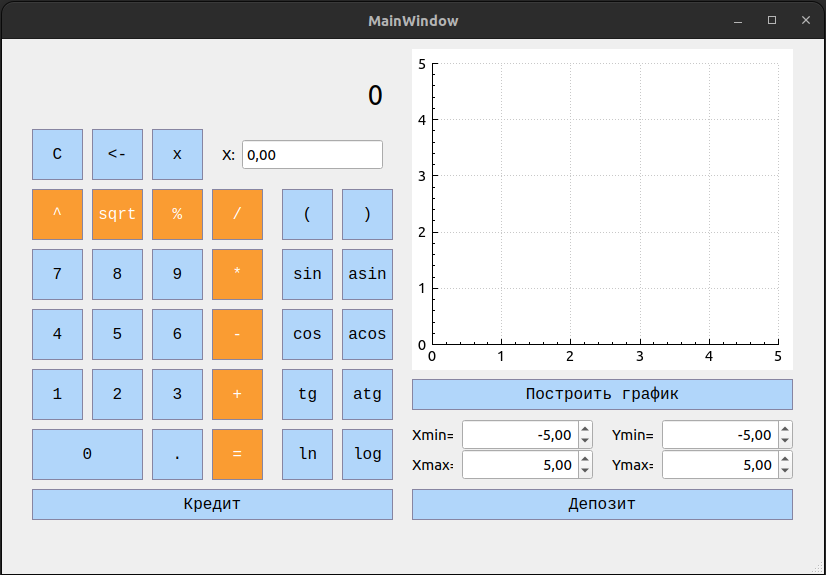
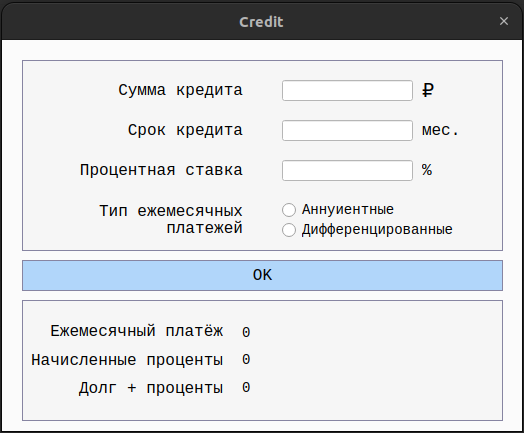
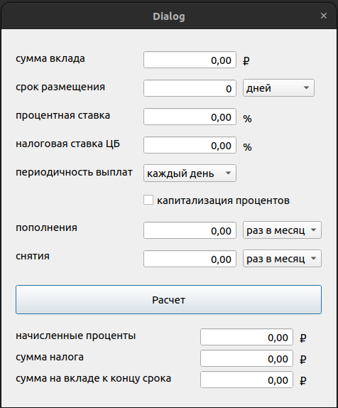

# SmartCalc v2.0 С++

SmartCalc v2.0 - это программа разработаная на языке C++ для выполнения арифметических вычислений и построения графиков функций.

## Реализация SmartCalc v2.0

- Программа разработана на языке C++17 c cоблюдением стандартов оформления кода Google стиле
- Сборка программы настроена с помощью Makefile со стандартным набором целей для GNU-программ;
- Обеспечено покрытие unit-тестами c помощью библиотеки GTest;
- Реализация с графическим пользовательским интерфейсом -Qt;
- Программа реализована с использованием паттерна MVC;

## Функционал

- На вход программы могут подаваться как целые числа, так и вещественные числа;
- Вычисление произвольных скобочных арифметических выражений в инфиксной нотации;
- Вычисление произвольных скобочных арифметических выражений в инфиксной нотации с подстановкой значения переменной _x_ в виде числа;
- Построение графика функции, заданной с помощью выражения в инфиксной нотации с переменной _x_ (с координатными осями, отметкой используемого масштаба);
- Кредитный калькулятор, депозитный калькулятор

## Кредитный калькулятор

 - Вход: общая сумма кредита, срок, процентная ставка, тип (аннуитетный, дифференцированный);
 - Выход: ежемесячный платеж, переплата по кредиту, общая выплата.

## Депозитный калькулятор

 - Вход: сумма вклада, срок размещения, процентная ставка, налоговая ставка, периодичность выплат, капитализация процентов, список пополнений, список частичных снятий;
 - Выход: начисленные проценты, сумма налога, сумма на вкладе к концу срока.

## Требования к установке

Для установки и сборки проекта требуется следующее:
- qmake6
- Компилятор gcc
- make

## Установка

- Откройте терминал и перейдите в директорию проекта src
- Введите команду:
`make install`

## Удаление 
- Откройте терминал и перейдите в директорию проекта src
- Введите команду: 
`make uninstall`